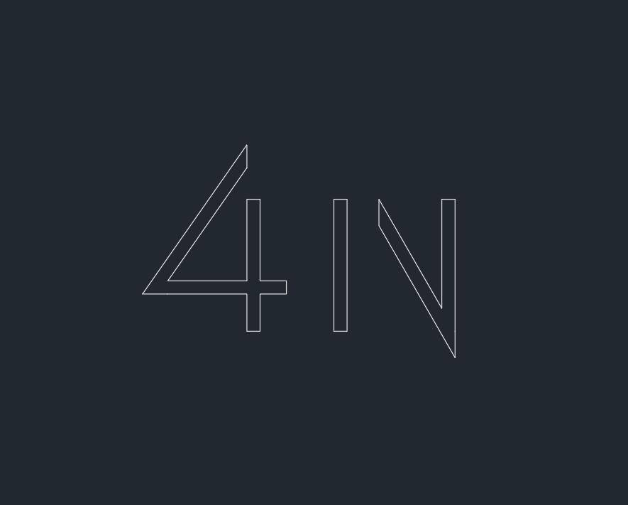
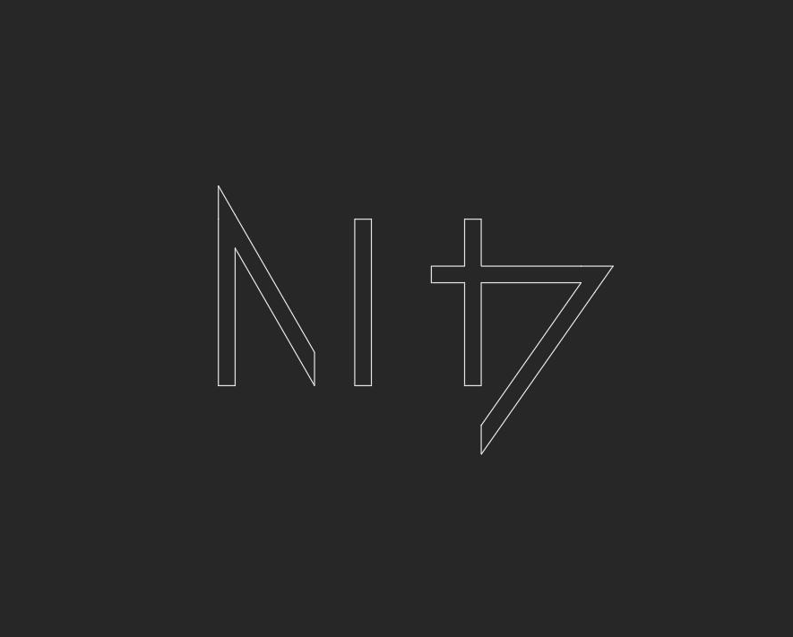
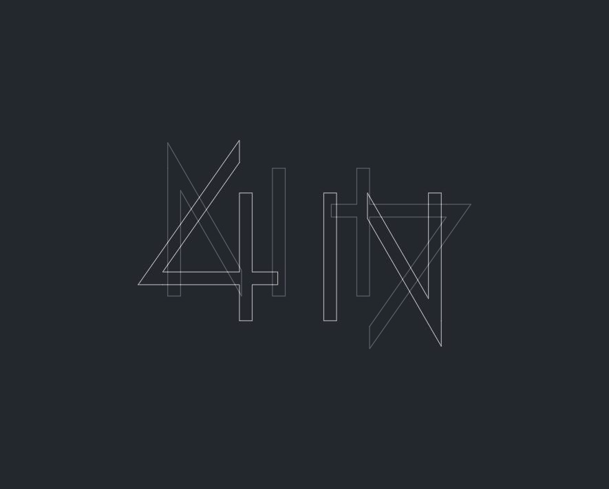

## OpenCV-python OpenCV 图像上的算数运算

### 1. 图像加法

`cv2.add()`将两幅图像进行加法运算，也可以使用`numpy`，`res=img1+img2`。两幅图像的大小，类型必须一致，或者第二个图像可以是一个简单的标量值。

openCV的加法是一种饱和操作，而numpy的加法是一种模操作。

例如：

```python
x=np.uint8([250])
y=np.uint8([10])
print(cv2.add(x,y))#250+10=260>=255
#结果为[[255]]
print (x+y)#250+10=260%255=4
#结果为[4]
```

OpenCV的结果会更好。

### 2. 图像混合

这也是加法，不同的是两幅图像的权重不同，这会给人一种混合或者透明的感觉。图像混合的计算公式如下：
$$
g(x)=(1-\alpha )f_0(x)+\alpha f_1(x)
$$
通过修改$\alpha$的值，可以实现图像混合效果。

例如：

将两图图像进行混合，第一幅图像权重为0.7，第二幅图像权重为0.3.

函数`cv2.addWeighed()`可以按照如下公式对图片进行混合：
$$
dst=\alpha*img_1 + \beta *img_2 + \gamma
$$
这里，$\gamma$取值为0.

$img_1$:



$img_2$:



代码实现：

```python
import cv2
import numpy as np
img1=cv2.imread('1.jpg')
img2=cv2.imread('2.png')

dst = cv2.addWeighted(img1,0.7,img2,0.3,0)

cv2.imshow('dst',dst)
cv2.waitKey(0)
cv2.imwrite('3.png', dst)
cv2.destroyAllWindows()
```

运行结果：



### 3. 按位运算

这里包括按位操作有：AND，OR，NOT，XOR等，当我们提取图像的一部分，选择非矩形ROI时，会很有用（下章）。下面进行如何改变一幅图的特定区域。

运行结果：

```python
import cv2
import numpy as np
img1=cv2.imread('45.jpg')
img2=cv2.imread('messigray.png')

# I want to put logo on top-left corner, So I create a ROI
rows,cols,channels = img2.shape
roi = img1[0:rows,0:cols]

# Now create a mask of logo and create its inverse mask also
img2gray = cv2.cvtColor(img2,cv2.COLOR_BGR2GRAY)
ret,mask = cv2.threshold(img2gray,175,255,cv2.THRESH_BINARY)
mask_inv = cv2.bitwise_not(mask)

# Now black-out the area of logo in ROI
#取ROI中与mask中不为零的值对应的像素的值，其让值为0 。
#注意这里必须有mask=mask或者mask=mask_inv，其中mask=不能忽略
img1_bg = cv2.bitwise_and(roi,roi,mask=mask)
#取roi中与mask_inv中不为零的值对应的像素的值，其他值为0
# Take only region of logo from logo image.
img2_fg = cv2.bitwise_and(img2,img2,mask=mask_inv)

# Put logo in ROI and modify the main image
dst = cv2.add(img1_bg,img2_fg)
img1[0:rows,0:cols] =dst

cv2.imshow('res',img1)
cv2.waitKey(0)
cv2.destroyAllWindows()
```


