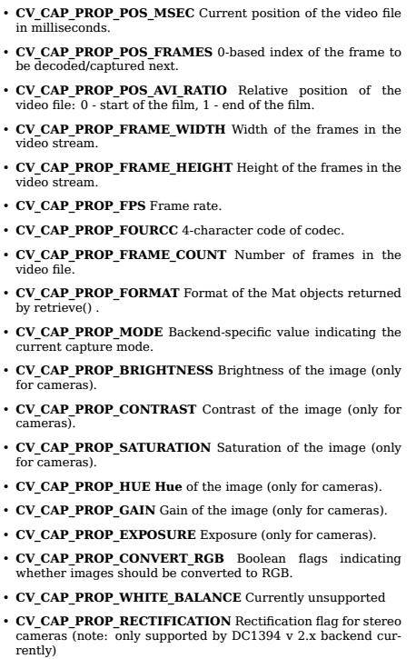

## OpenCV-python 学习笔记 OpenCV视频操作

### 1. 使用摄像头捕获视频

`cv2.VedioCapture()`

输入参数为0为“计算机默认摄像头“，1可以更换来源。

例如：

```python
import numpy as np
import cv2

cap = cv2.VideoCapture(0)  # 计算机摄像头
while (True):
    # 逐帧捕捉图像
    ret, frame = cap.read()

    # our operation on the frame come here
    gray = cv2.cvtColor(frame, cv2.COLOR_BGR2GRAY)  # 转换为灰度图像

    # display the resulting frame
    cv2.imshow('frame', gray)  # 展示当前帧
    if cv2.waitKey(1) & 0xFF == ord('q'):  # 按q键退出
        break
# when everything done , release the capture
cap.release()
cv2.destroyAllWindows()  # 关闭所有窗口
```

当代码报错时，可以使用`cap.isOpend()`来检查是否成功初始化，若返回值为`True`,说明摄像头正常打开，否则需要使用`cap.open()`.

获取视频的参数信息，使用`cap.get(propld)`来获取视频的一些参数信息，`propld`可以是0~18的任何数，每个数代表一个属性。

修改某些值，可以使用`cap.set(propld, value)`来修改，例如`cap.get(3)`和`cap.get(4)`来查看每一帧的宽和高，默认是`640x480`。我们可以使用r`et=cap.set(3,320)`和ret `= cap.set(4,240)`来把宽和高改成`320x240`.

### 2. 从文件中播放视频

`cv2.VedioCapture()`

将原先填入的”设备索引号”改成“文件名”即可。

在播放每一帧时，使用`cv2.waitKey()`适当持续一段时间，一般可以设置为`25ms`（帧率）。

例如：

```python
import cv2

cap = cv2.VideoCapture('test vedio.mov')  #视频文件
while (True):
    # 逐帧捕捉图像
    ret, frame = cap.read()

    # our operation on the frame come here
    gray = cv2.cvtColor(frame, cv2.COLOR_BGR2GRAY)  # 转换为灰度图像

    # display the resulting frame
    cv2.imshow('frame', gray)  # 展示当前帧
    cv2.waitKey(25)
    if cv2.waitKey(1) & 0xFF == ord('q'):  # 按q键退出
        break
# when everything done , release the capture
cap.release()
cv2.destroyAllWindows()  # 关闭所有窗口
```

修改视频流属性：



### 3. 保存视频

创建一个`vedioWrite`对象，确定输出文件名，执行`FourCC`编码，播放帧率和帧大小，最后设置`isColor`标签为`True`彩色。

`FourCC`是一个4子节码，用来确定视频的编码格式

1.In Fedora : DIVX , XVID , MJPG , X264 , WMV1 , WMV2，XVID是最好的，MJPG是高尺寸视频，X264得到小尺寸视频
2.In Windows : DIVX

设置`FourCC`格式时，原文里采用了`cv2.VideoWriter_fourcc()`这个函数，若运行程序的时候显示这个函数不存在，可以改用了`cv2.cv.CV_FOURCC`这个函数。

例如：

```python
cap = cv2.VideoCapture(0)

# Define the codec and create VideoWriter object
fourcc = cv2.VideoWriter_fourcc(*'XVID')
out = cv2.VideoWriter('output.avi',fourcc, 20.0, (640,480))

while(cap.isOpened()):
    ret, frame = cap.read()
    if ret==True:
        frame = cv2.flip(frame,0)

        # write the flipped frame
        out.write(frame)

        cv2.imshow('frame',frame)
        if cv2.waitKey(1) & 0xFF == ord('q'):
            break
    else:
        break

# Release everything if job is finished
cap.release()
out.release()
cv2.destroyAllWindows()
```

