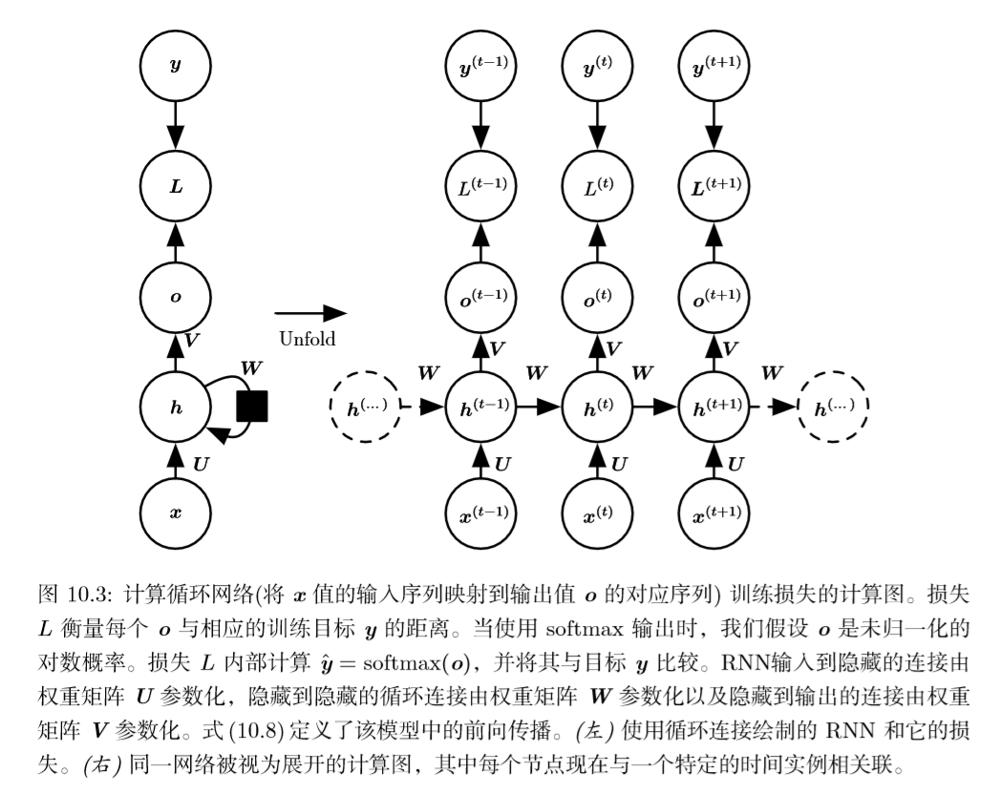
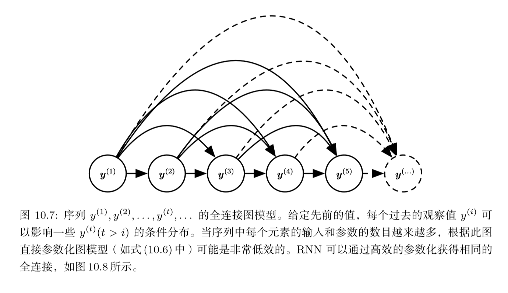
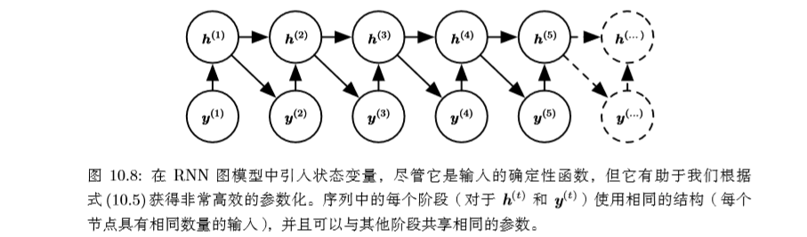
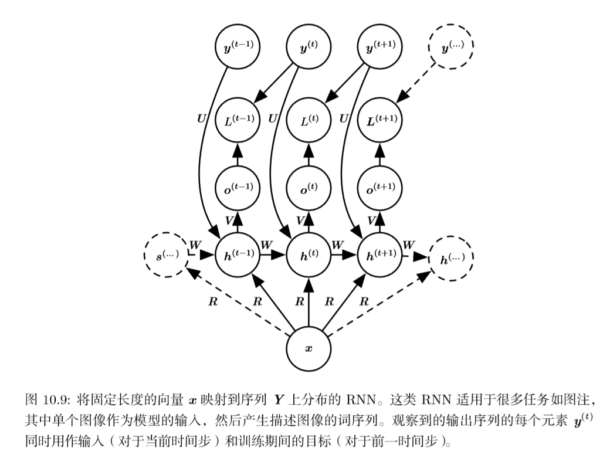
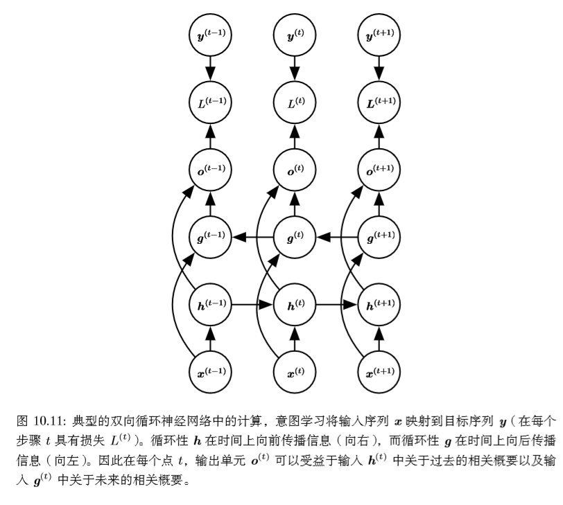

## 循环神经网络 

**循环神经网络**（recurrent neural network）或**RNN**是一类用于处理序列数据$x^{(1)},...,x^{(n)}$的神经网络。循环网络可以拓展到更长的序列，大多数循环网络能处理可变长度的序列。

我们可以利用**在模型的不同部分共享参数** 这一思想的优点，参数共享使得模型能够扩展到不同形式的样本（这里指不同长度的样本）并进行泛化。RNN在几个时间步内共享相同的权重，不需要分别学习句子每个位置的所有语言规则。

一个相关的想法是在1维时间序列上使用卷积。这种卷积方法是时延神经网络的基础。卷积操作允许网络跨时间，浅层地共享参数。循环神经网络以不同的方式共享参数，输出的每一项是前一项的函数。每一项输出的产生，对先前的输出应用相同的更新规则，这种循环方式导致参数可以通过很深的计算图实现共享。

RNN是指在序列上的操作，并且该序列在时刻$t$（从1到$\tau$）包含向量$x^{(t)}$，实际情况中，循环网络通常在序列的小批量上操作，并且小批量的每项具有不同序列长度$\tau$。时间步索引不一定是现实世界中的时间，也可能仅表示序列中的位置。RNN也可以应用于跨越两个维度的空间数据。

### 1.计算图

计算图被定义为有向图，其中节点对应于数学运算。 计算图是表达和评估数学表达式的一种方式（语言）。

我们使用图中的每一个节点表示一个变量，变量可以是标量、向量、矩阵、张量等。

为了形式化图形，需要引入**操作**（operation）这一概念。操作是指一个或多个变量的简单函数。

如果变量$y$是变量$x$通过一个操作计算得到的，那么画一条从$x$到$y$的有向边。我们有时用操作的名称来注释输出的节点，当上下文很明确时，有时也会省略这个标注。 

计算图实例：

.png)

### 2. 展开计算图

计算图是形式化一组计算结构的方式，如涉及将输入和参数映射到输出和损失的计算。

**展开**（unfolding）这个计算图将导致深度网络结构中的参数共享。

>  例1：
>
> 考虑动态系统的经典形式：
> $$
> s^{(t)} = f(s^{(t-1)};\theta) \tag 1
> $$
> 其中$s^{(t)}$称为系统的状态。
>
> $s$在时刻$t$的定义需要参考时刻$t-1$时同样的定义，因此上式是循环的。
>
> 对于有限时间步$\tau$，$\tau -1$次应用这个定义可以展开这个图。例如$\tau=3$，我们对$(1)$式展开，得到：
> $$
> \begin{aligned} \boldsymbol{s}^{(3)} &=f\left(\boldsymbol{s}^{(2)} ; \boldsymbol{\theta}\right) \\ &=f\left(f\left(\boldsymbol{s}^{(1)} ; \boldsymbol{\theta}\right) ; \boldsymbol{\theta}\right) \end{aligned} \tag{2}
> $$
> 上式的展开计算图如图所示：
>
> .png)
>
> 
>
> 例2:
>
> 考虑由外部信号$x^{(t)}$驱动的动态系统：
> $$
> s^{(t)}=f(s^{(t-1)};x^{(t)};\theta) \tag{3}
> $$
> 可以看到当前状态包含了整个过去序列的信息。

为了表明状态是网络的隐藏单元，我们使用变量$h$代表状态重写式$(3)$:
$$
h^{(t)} = f(h^{(t-1)}, x^{(t)};\theta) \tag{4}
$$
很多循环神经网络使用式$(4)$或类似形式的公式定义隐藏单元的值。

如下图所示，典型的RNN会增加额外的架构特性，如读取状态信息$h$进行预测的输出层:

.png)

当训练循环网络根据过去预测未来时，网络通过长要学会使用$h^{(t)}$作为过去序列（直到$t$）与任务相关方面的有损摘要。此摘要一般一定是有损的，因为其映射任意长度的序列$(x^{(t)}, x^{(t-1)}, ...,x^{(2)}, x^{(1)})$到一固定长度的向量。对于具体的训练准则，摘要可能选择性地精确保留过去序列的某些东西。最苛刻的情况是我们要求$h^{(t)}$足够丰富，并能大致恢复输入序列，如自编码器框架。

式$(4)$可以用两种不同的方式绘制，一种方法是为可能在模型的物理实现中存在的部分赋予一个节点，如生物神经网络，在这个观点下，网络定义了实时操作的回路，其当前状态可以影响其未来的状态。另一种方法是展开的计算图，所谓的展开是将左图中的回路淫蛇为右图中包含重复组件的计算图的操作，展开图的大小取决于序列的长度。

我们可以用一个函数$g^{(t)}$代表$t$步展开后的循环：
$$
\boldsymbol{h}^{(t)}=g^{(t)}\left(\boldsymbol{x}^{(t)}, \boldsymbol{x}^{(t-1)}, \boldsymbol{x}^{(t-2)}, \ldots, \boldsymbol{x}^{(2)}, \boldsymbol{x}^{(1)}\right) \tag{5}
$$

$$
=f\left(\boldsymbol{h}^{(t-1)}, \boldsymbol{x}^{(t)} ; \boldsymbol{\theta}\right) \tag{6}
$$

函数$g^{(t)}$将全部的过去序列$\left(\boldsymbol{x}^{(t)}, \boldsymbol{x}^{(t-1)}, \boldsymbol{x}^{(t-2)}, \ldots, \boldsymbol{x}^{(2)}, \boldsymbol{x}^{(1)}\right)$作为输入来生成当前的状态，但是展开的循环架构允许我们将$g^{(t)}$分解为函数$f$的重复应用。展开过程引入两个主要优点：

1. 无论序列的长度，学成的模型始终**具有相同的输入大小**，因为它指定的是从一种状态到另一种状态的转移，而不是在可变长度的历史状态上操作。
2. 我们可以在每个时间步**使用相同参数的相同转移函数**$f$

### 3. 循环神经网络

基于计算图展开和参数共享的思想，我们可以设计各种循环神经网络。

图：计算循环网络

循环神经网络一些重要的设计模式包括：

1. 每个时间步都有输出，并且隐藏单元之间有循环连接的循环网络。
2. 每个时间步都产生一个输出，只有当前时刻的输出到下个时刻的隐藏单元之间有循环连接的循环网络。
3. 隐藏单元之间存在循环连接，但读取整个序列后产生单个输出的循环网络。

图：此类RNN的唯一循环是从输出到隐藏层的反馈连接

任何图灵可计算的函数都可以通过这样一个有限维的循环网络计算。RNN经过若干时间步后读取输出，这与由图灵机所用的时间步是渐进线性的，与输出长度渐进线性的。图灵机的 ‘‘输入’’ 是要计算函数的详细说明 (specification)，所以模拟此图灵机的相同网络足以应付所有问题。用于证明的理论 RNN 可以通过激活和权重（由无限精度的有理 数表示）来模拟无限堆栈。 

考虑计算循环网络的前向传播：

假设使用$tanh$函数作为激活函数，假设输出是离散的（如用于预测词或字符的RNN），表示离散变量的常规方式是把输出$o$作为每个离散变量可能值的非标准化对数概率。然后可以应用$softmax$函数后续处理，得到标准化后概率的输出向量$\hat{y}$，初始状态记为$h^{(0)}$。

从$t=1$到$t=\tau$的每个时间步，应用更新：
$$
a^{(t)}=b + Wh^{(t-1)}+Ux^{(t)} \tag{7}
$$
$$
\boldsymbol{h}^{(t)}=\tanh \left(\boldsymbol{a}^{(t)}\right) \tag{8}
$$
$$
\boldsymbol{o}^{(t)}=\boldsymbol{c}+\boldsymbol{V} \boldsymbol{h}^{(t)} \tag{9}
$$

$$
\hat{\boldsymbol{y}}^{(t)}=\operatorname{softmax}\left(\boldsymbol{o}^{(t)}\right) \tag{10}
$$

其中参数的偏置向量$b$和$c$连同权重矩阵$U、V$和$W$,分别对应于输入到隐藏、隐藏到输出、隐藏到隐藏的连接。这个循环网络将一个输入序列映射到相同长度的输出序列。与$x$序列配对的$y$的总损失就是所有时间步的损失之和。

例如，$L^{(t)}$为给定$x^{(1)},...,x^{(t)}$后$y^{(t)}$的负对数似然，则
$$
L\left(\left\{x^{(1)}, \ldots, x^{(\tau)}\right\},\left\{y^{(1)}, \ldots, y^{(\tau)}\right\}\right) \tag{11}
$$

$$
=\sum_{t} L^{(t)} \tag{12}
$$

$$
=-\sum_{t} \log p_{\text {model }}\left(y^{(t)} |\left\{x^{(1)}, \ldots, x^{(t)}\right\}\right) \tag{13}
$$

其中$p_{\text {model }}\left(y^{(t)} |\left\{x^{(1)}, \ldots, x^{(t)}\right\}\right)$需要读取模型输出向量$\hat{y}^{(t)}$中对应于$y^{(t)}$的项。

梯度计算运行时间是$O(\tau)$,内存代价是$O(\tau)$。应用于展开图且代价为$O(\tau)$的反向传播算法称为**通过时间反向传播**（back-propagation through time, BPTT）

#### 3.1 导师驱动过程（teacher forcing）和输出循环网络

由输出反馈到模型而产生循环连接的模型可用**导师驱动过程**(teacher forcing) 进行训练。

teacher forcing不再使用最大似然准则，而在时刻$t+1$接受真实值$y^{(t)}$作为输入。

条件最大似然准则是：
$$
\log p\left(\boldsymbol{y}^{(1)}, \boldsymbol{y}^{(2)} | \boldsymbol{x}^{(1)}, \boldsymbol{x}^{(2)}\right) \tag{14}
$$

$$
=\log p\left(\boldsymbol{y}^{(2)} | \boldsymbol{y}^{(1)}, \boldsymbol{x}^{(1)}, \boldsymbol{x}^{(2)}\right)+\log p\left(\boldsymbol{y}^{(1)} | \boldsymbol{x}^{(1)}, \boldsymbol{x}^{(2)}\right) \tag{15}
$$

在上述例子中，在时刻$t=2$时，模型被训练为最大化$y^{(2)}$的条件概率。因此最大似然在训练时指定正确反馈，而不是将自己的输出反馈到模型。

 

我们使用导师驱动过程的最初动机是为了在缺乏隐藏到隐藏连接的模型中避免通过时间反向传播。只要模型一个时间步的输出与下一时间步计算的值存在连接， 导师驱动过程仍然可以应用到这些存在隐藏到隐藏连接的模型。然而，只要隐藏单元成为较早时间步的函数，BPTT 算法是必要的。因此训练某些模型时要同时使 用导师驱动过程和 BPTT。 

如果之后网络在**开环**(open-loop)模式下使用，即网络输出（或输出分布的样本）反馈作为输入，那么完全使用teacher forcing的缺点就会出现：训练期间该网络看到的输入与测试时看到的会有很大的不同。减轻此问题的方法：（1）同时使用teacher forcing和自由运行的输入进行训练，这样，网络可以学会考虑在训练时没有接触到的输入条件，以及将状态映射回使得网络几步后生成正确输出的状态。（2）随意选择生成值或真实的数据值作为输入以减小训练时和测试时看到的输入之间的差别。

#### 3.2 计算循环神经网络的梯度

通过BPTT计算上式（7）和式（11）的梯度。

计算图节点包括参数$U,V,W,b,c$，以及以$t$为索引的节点序列$x^{(t)}$,$h^{(t)},o^{(t)},L^{(t)}$.对于每个节点$N$,需要基于$N$后面的节点的梯度，递归地计算梯度$
\nabla_{\mathbf{N}} L
$。先从最终损失的节点开始递归：
$$
\frac{\partial L}{\partial L^{(t)}}=1 \tag{16}
$$
假设输出$o^{(t)}$作为$softmax$函数的参数，可以从$softmax$函数获得关于输出概率的向量$\hat{y}$，也假设损失是给定输入后的真实目标$y^{(t)}$的负对数似然。则对于所有$i,t$，关于时间步$t$输出的梯度$\nabla_{\boldsymbol{o}^{(t)}} \boldsymbol{L}$：
$$
\left(\nabla_{o^{(l)}} L\right)_{i}=\frac{\partial L}{\partial o_{i}^{(t)}}=\frac{\partial L}{\partial L^{(t)}} \frac{\partial L^{(t)}}{\partial o_{i}^{(t)}}=\hat{y}_{i}^{(t)}-1_{i, y^{(l)}} \tag{17}
$$
在最后的时间步$\tau$,$h^{(\tau)}$只有$o^{(\tau)}$作为后续节点，则梯度：
$$
\nabla_{\boldsymbol{h}^{(\tau)}} L=\boldsymbol{V}^{\top} \nabla_{\boldsymbol{o}^{(\tau)}} L \tag{18}
$$
从时刻$t=\tau-1$到$t=1$反向迭代，$h^{(t)}$($t <\tau$)同时具有$o^{(t)}$和$h^{(t+1)}$两个后续节点，则梯度：
$$
\nabla_{\boldsymbol{h}^{(t)}} L=\left(\frac{\partial \boldsymbol{h}^{(t+1)}}{\partial \boldsymbol{h}^{(t)}}\right)^{\top}\left(\nabla_{\boldsymbol{h}^{(t+1)}} L\right)+\left(\frac{\partial \boldsymbol{o}^{(t)}}{\partial \boldsymbol{h}^{(t)}}\right)^{\top}\left(\nabla_{\boldsymbol{o}^{(t)}} L\right) \tag{19}
$$

$$
=\boldsymbol{W}^{\top}\left(\nabla_{\boldsymbol{h}^{(l+1)}} L\right) \operatorname{diag}\left(1-\left(\boldsymbol{h}^{(t+1)}\right)^{2}\right)+\boldsymbol{V}^{\top}\left(\nabla_{\boldsymbol{o}^{(t)}} L\right) \tag{20}
$$

其中$\operatorname{diag}\left(1-\left(\boldsymbol{h}^{(t+1)}\right)^{2}\right)$表示包含元素$1-\left(h_{i}^{(t+1)}\right)^{2}$的对角矩阵，这是关于时刻$t+1$与隐藏单元$i$关联的双曲正弦$Jacobian$.

我们希望实现的等式使用$bprop$方法计算计算图单一边对梯度的贡献，然而$\nabla_{W}f $算子，计算$W$对于$f$贡献时将计算激素那图中的所有边，则定义只在$t$时刻使用的虚拟变量$\boldsymbol{W}^{(t)}$作为$\boldsymbol{W}$的副本，然后使用$\nabla_{\boldsymbol{W}^{(t)}}$表示权重在时间步$t$对梯度的贡献。

则剩余参数的梯度：

$$
\nabla_{c} L=\sum_{t}\left(\frac{\partial \boldsymbol{o}^{(t)}}{\partial c}\right)^{\top} \nabla_{o^{(t)}} L=\sum_{t} \nabla_{o^{(t)}} L \tag{21}
$$

$$
\nabla_{b} L=\sum_{t}\left(\frac{\partial \boldsymbol{h}^{(t)}}{\partial \boldsymbol{b}^{(t)}}\right)^{\top} \nabla_{\boldsymbol{h}^{(t)}} L=\sum_{t} \operatorname{diag}\left(1-\left(\boldsymbol{h}^{(t)}\right)^{2}\right) \nabla_{\boldsymbol{h}^{(t)}} L \tag{22}
$$ { }

$$
\nabla_{V} L=\sum_{t} \sum_{i}\left(\frac{\partial L}{\partial o_{i}^{(t)}}\right) \nabla_{V} o_{i}^{(t)}=\sum_{t}\left(\nabla_{\boldsymbol{o}^{(t)}} L\right) \boldsymbol{h}^{(t)^{\top}} \tag{23}
$$

$$
\begin{aligned} \nabla_{W} L &=\sum_{t} \sum_{i}\left(\frac{\partial L}{\partial h_{i}^{(t)}}\right) \nabla_{W^{(t)}} h_{i}^{(t)} \\ &=\sum_{t} \operatorname{diag}\left(1-\left(h^{(t)}\right)^{2}\right)\left(\nabla_{h^{(t)}} L\right) h^{(t-1)^{T}} \end{aligned} \tag{24}
$$

$$
\begin{aligned} \nabla_{U} L &=\sum_{t} \sum_{i}\left(\frac{\partial L}{\partial h_{i}^{(t)}}\right) \nabla_{U^{(t)}} h_{i}^{(t)} \\ &=\sum_{t} \operatorname{diag}\left(1-\left(\boldsymbol{h}^{(t)}\right)^{2}\right)\left(\nabla_{h^{(t)}} L\right) \boldsymbol{x}^{(t)^{\top}} \end{aligned} \tag{25}
$$

#### 3.3 作为有向图模型的循环网络

与前馈网络类似，原则上循环网络几乎可以使用任何损失。但必须根据任务来选择损失。

当我们使用一个预测性对数似然的训练目标，我们将 RNN 训练为能够根据之前的输入估计下一个序列元素$y^{(t)}$的条件分布。这可能意味着，我们最大化对数似然 
$$
\log p\left(\boldsymbol{y}^{(t)} | \boldsymbol{x}^{(1)}, \ldots, \boldsymbol{x}^{(t)}\right) \tag{26}
$$
或者，如果模型包括来自一个时间步的输出到下一个时间步的连接
$$
\log p\left(\boldsymbol{y}^{(t)} | \boldsymbol{x}^{(1)}, \ldots, \boldsymbol{x}^{(t)}, \boldsymbol{y}^{(1)}, \ldots, \boldsymbol{y}^{(t-1)}\right) \tag{27}
$$
将整个序列 $y$ 的联合分布分解为一系列单步的概率预测是捕获关于整个序列完整联合分布的一种方法。当我们反馈真实的$y$值（不是它们的预测值，而是真正观测到或生成的值）给网络时，那么有向图模型包含所有从过去 $y^{(i)}$ 到当前 $y^{(t) }$的边。

> 例如：
>
> 考虑随机变量序列$\mathbb{Y}=\left\{\mathbf{y}^{(1)}, \ldots, \mathbf{y}^{(\tau)}\right\}$建模RNN，无额外的输入$x$。在时间步$t$的输入仅是时间步$t-1$的输出。该RNN定义了关于变量$y$的有向图模型，使用链式法则参数化这些观察值的联合分布:
> $$
> P(\mathbb{Y})=P\left(\mathbf{y}^{(1)}, \ldots, \mathbf{y}^{(\tau)}\right)=\prod_{t=1}^{\tau} P\left(\mathbf{y}^{(t)} | \mathbf{y}^{(t-1)}, \mathbf{y}^{(t-2)}, \ldots, \mathbf{y}^{(1)}\right) \tag{28}
> $$
> 其中当$t=1$时竖杠右侧为空。
>
> 根据此模型，一组值$\{y^{(1)}, ...,y^{(\tau)}\}$的负对数似然为：
> $$
> L=\sum_{t}{L^{(t)}} \tag{29}
> $$
> 其中
> $$
> L^{(t)}=-logP(\mathbb{y}^{(t)}=y^{(t)}|y^{(t-1)}, ...,y^{(1)}) \tag{30}
> $$
> 

图模型中的边表示哪些变量直接依赖于其他变量。

解释 RNN 作为图模型的一种方法是将RNN视为定义一个结构为完全图的图模型，且能够表示任何一对$y$值之间的直接联系。

循环网络为减少的参数数目付出的代价是优化参数可能变得困难。

在循环网络中使用的参数共享的前提是相同参数可用于不同时间步的假设。假设给定时刻$t$的变量后，时刻$t+1$变量的条件概率分布时**平稳的**（stationary）这意味着之前的时间步与下个时间步之间的关系并不依赖于$ t$。

为了完整描述将 RNN 作为图模型的观点，我们必须描述如何从模型采样。我们 需要执行的主要操作是简单地从每一时间步的条件分布采样。然而，这会导致额外 的复杂性。RNN 必须有某种机制来确定序列的长度。这可以通过多种方式实现。 

在当输出是从词汇表获取的符号的情况下，我们可以添加一个对应于序列末端 的特殊符号 (Schmidhuber, 2012)。当产生该符号时，采样过程停止。在训练集中， 我们将该符号作为序列的一个额外成员，即紧跟每个训练样本 $x^{(τ)}$ 之后。

 另一种选择是在模型中引入一个额外的 $Bernoulli$ 输出，表示在每个时间步决定继续生成或停止生成。

#### 3.4 基于上下文的RNN序列建模

一般情况下，RNN 允许将图模型的观点扩展到不仅代表 $y $变量的联合分布, 也能表示给定$ x $后$ y $条件分布。如前馈网络情形中，任何代表变量$P(y;\theta)$的模型都可被解释为代表条件分布$P(y|\omega)$，其中$\omega=\theta$。

考虑只使用单个向量$x$作为RNN的输入。当$x$是一个固定大小的向量时，可以将其看作产生$y￥序列的RNN额外输入。

将额外输入提供到RNN的常见方法：

1. 在每个时刻作为一个额外输入
2. 作为初始状态$h^{(0)}$
3. 结合以上两种方式

输入 $x $和每个隐藏单元向量 $h^{(t)} $之间 的相互作用是通过新引入的权重矩阵$ R $参数化的，这是只包含$ y$ 序列的模型所没有的。同样的乘积$ x^⊤R $在每个时间步作为隐藏单元的一个额外输入。我们可以认为$ x $的选择（确定$ x^⊤R$ 值），是有效地用于每个隐藏单元的一个新偏置参数。权重与输 入保持独立。我们可以认为这种模型采用了非条件模型的$\theta$，并将$ ω $代入$ θ$，其中 $ω $内的偏置参数现在是输入的函数。 

RNN 可以接收向量序列$ x^{(t) }$作为输入，而不是仅接收单个向量 $x $作为输入。 式（7）描述的RNN对应条件分布$P(y^{(1)},...,y^{(\tau)}|x^{(1)},...,x^{(\tau)})$,并在条件独立的假设下这个分布分解为：
$$
\prod_{t}{P(y^{(t)}|x^{(1)}, ... ,x^{(t)})} \tag{31}
$$
为去掉条件独立的假设，我们可以在时刻$ t $的输出到时刻$ t + 1 $的隐藏单元添加连接:

该模型就可以代表关于$ y$ 序列的任意概率分布。这种给定一个序列表示另一个序列分布的模型有一个限制，就是这两个序列的长度必须是相同的。

### 4. 双向RNN

双向循环神经网络（或双向 RNN）为满足**输出的$y^{(t)}$的预测可能依赖于整个输入序列**这一需求而被发明。

双向 RNN 结合时间上从序列起点开始移动的 RNN 和另一个时间上从序列末尾开始移动的 RNN。

其中$h^{(t)}$代表通过时间向前移动的子RNN状态，$g^{(t)}$代表通过实践向后移动的子RNN状态。

这允许输出单元$ o^{(t)}$ 能够计算同时依赖于过去和未来且对时刻 $t $的输入值最敏感的表示，而不必指定$ t $周围固定大小的窗口（这是前馈网络、卷积网络或具有固定大小的先行缓存器的常规 RNN 所必须要做的）。

该想法可以拓展到到2维输入，如图像，由四个RNN组成，每一个沿着四个方向中的一个计算：上、下、左、右。如果 RNN 能够学习到承载长期信息，那在 2 维网格每个点 $(i,j) $的输出$O_{i,j}$就能计算一个能捕捉到大多局部信息但仍依赖于长期输入的表示。

相比卷积网络，应用于图像的 RNN 计算成本通常更高，但允许同一特征图的特征之间存在长期横向的相互作用 (Visin et al., 2015; Kalchbrenner et al., 2015)。实际上，对于这样的 RNN，前向传播公式可以写成表示使用卷积的形式，计算自底向上到每一层的输入（在整合横向相互作用的特征图的循环传播之 前）。