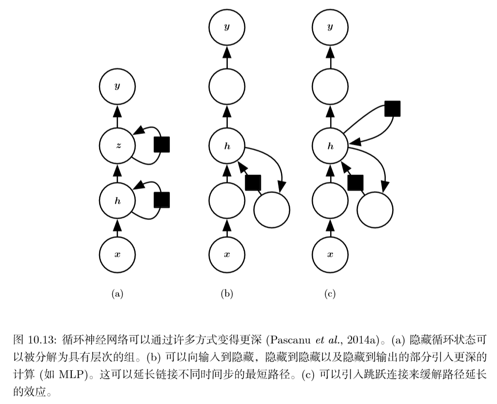
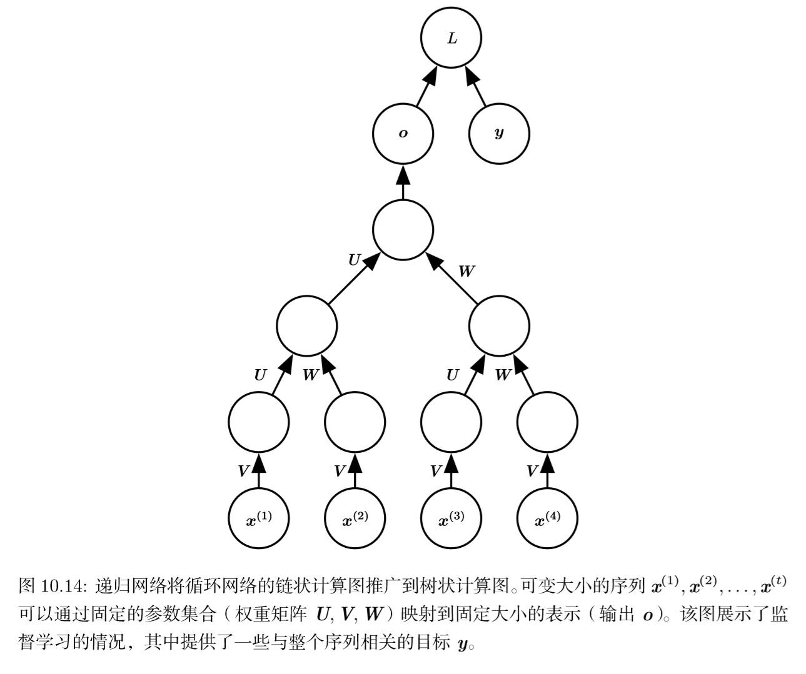
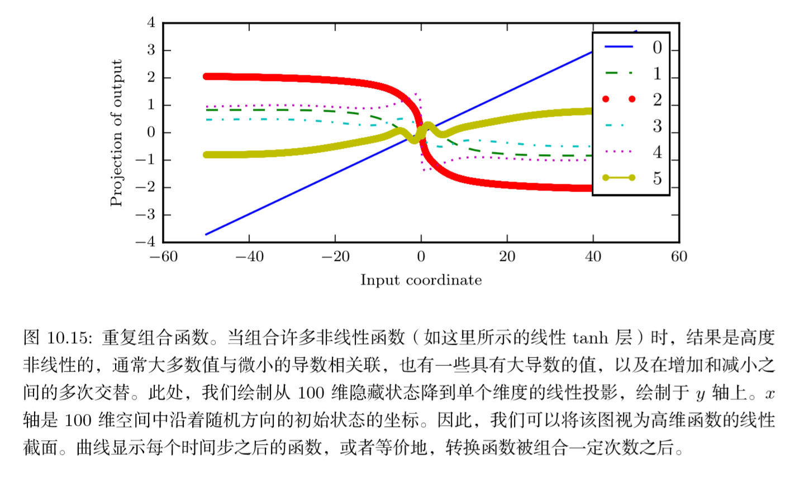

## 深度循环网络与递归神经网络

### 1. 深度循环网络

大多数RNN计算可分解称三块参数及其相关的变换：

1. 从输入到隐藏状态
2. 从前一隐藏状态到下一隐藏状态
3. 从隐藏状态到输出

上述三种变换都与单个权重矩阵相关联。能通过深度MLP内单个层来表示的变换称为**浅变换**，通常这是由学成的仿射变换和一个固定非线性表示组成的变换。

在循环网络中引入深度：

上图（a）中，较低层起到将原始输入转化为更高层的隐藏状态更合适表示的状态。

上图（b）中，将上述三个变换个使用一个单独的MLP（可以是存在深度的），考虑表示容量，建议在三个变换中都分配足够的容量，但增加深度可能会因为优化困难而损害学习效果。

上图（c）中，在隐藏到隐藏的路径中引入条约连接可以缓和（b）的问题。

### 2. 递归神经网络

递归神经网络代表循环网络的另一个拓展，被构造成深的**树状结构**而不是链状结构，是不同类型的计算图。

递归网络已经成功应用于输入是 *数据结构*   的神经网络，如NLP和CV。

递归网络的优势是：

对于具有相同长度$\tau$的序列，深度（通过非线性操作的组合数量来衡量）可以急剧地从$\tau$减少为$O(log\tau)$，有助于解决长期依赖。存在的问题是如何以最佳的方式构造树，一种选择是使用不依赖于数据的树结构，如平衡二叉树，在某些应用领域，外部方法可以为选择适当的树结构提供借鉴。

> 例如，处理自然语言的句子时，用于递归网络的树结构可以被固定为句 子语法分析树的结构（可以由自然语言语法分析程序提供）(Socher et al., 2011a,c)。 理想的情况下，人们希望学习器自行发现和推断适合于任意给定输入的树结构，如 (Bottou, 2011) 所建议

### 3. 长期依赖问题

根本问题在于，经过许多阶段传播后的梯度倾向于消失或爆炸，即使假设循环网络是参数稳定的(可存储记忆，且梯度不爆炸)，但长期依赖的困难来自于比短期相互作用指数小的权重（涉及许多$Jacobian$相乘）。

循环网络涉及相同函数的多次组合，每个时间步一次。这些组合可以导致极端非线性行为：

特别地，循环神经网络所使用的函数组合有点像矩阵乘法。可以认为，循环联系：
$$
\boldsymbol{h}^{(t)} = \boldsymbol{W}^T\boldsymbol{h}^{(t-1)} \tag{1}
$$
是一个非常简单的、缺少非线性激活函数和输入$x$的循环神经网络。

这种递推关系本质上描述了幂法，可被简化为：
$$
\boldsymbol{h}^{(t)} = (\boldsymbol{W}^t)^T\boldsymbol{h}^{(0)} \tag{2}
$$
而当$\boldsymbol{W}$符合如下特征分解（正交分解）：
$$
\boldsymbol{W}=\boldsymbol{Q}\boldsymbol{\Lambda}\boldsymbol{Q}^T \tag{3}
$$
其中$\boldsymbol{Q}$正交。循环型可进一步简化为：
$$
h^{(t)}=Q^T \Lambda Qh^{(0)} \tag{4}
$$
特征值提升到$t$次后。导致幅值小于1的特征值衰减到0，而赋值大于1就会激增。任何不与最大特征向量对其的$h^{(0)}$的部分将最终被丢弃。

该问题是针对循环网络的。在标量情况下多次乘一个权重$w$，该乘积$w^t$小时还是爆炸取决于$w$的幅值，而如果每个时刻使用不同权重$w^{(t)}$的非循环网络，给定初始状态为1，那么时刻题的状态可由$\Pi_tw^{(t)}$给出。假设$w^{(t)}$是随机生成的，各自独立且有0均值$v$方差。乘积的方差就为$o(v^n)$。为了获得某些希望的方差$v^*$，我们可以选择单个方差为$v=\sqrt[n]{v^*}$。因此非常深的前馈网络可以通过人为设计，避免梯度消失和爆炸问题。

本章的其余部分将讨论目前已经提出的降低学习长期依赖（在某些情况下，允许一个 RNN 学 习横跨数百步的依赖）难度的不同方法，但学习长期依赖的问题仍是深度学习中的一个主要挑战。